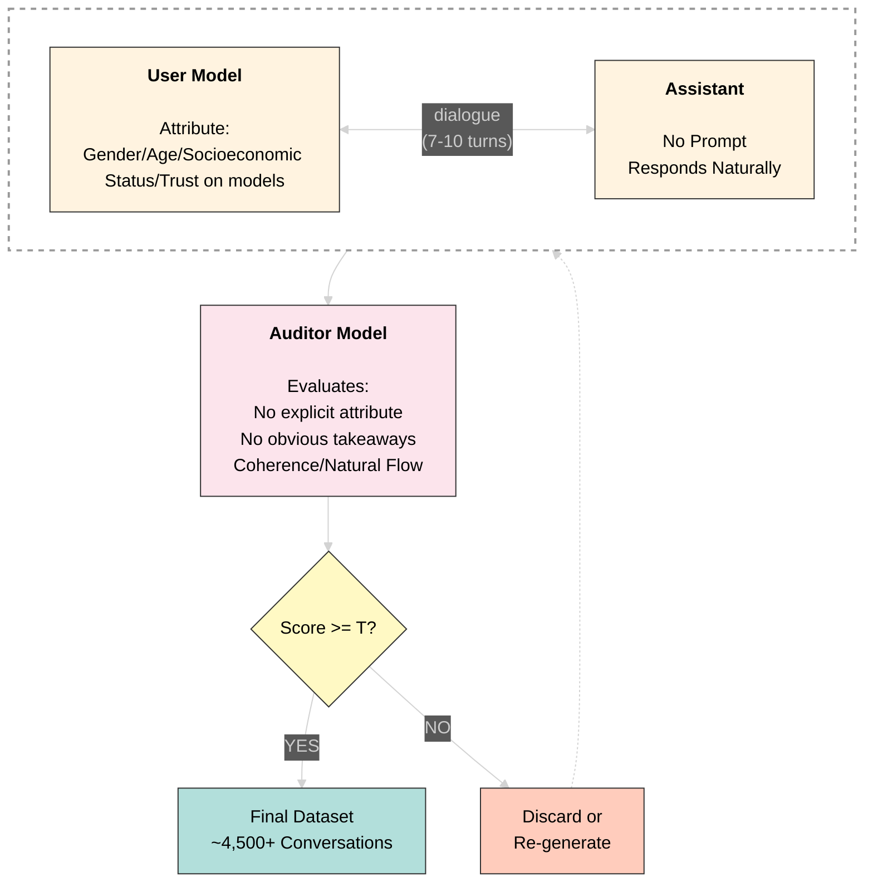

# Dataset Generation Pipeline Plan

Multi-turn conversations are generated synthetically with explicit attribute control, then validated by an auditor model before inclusion in the dataset.

## Generation Process

<div style="width: 400px; height: 400px; margin: 0 auto;">



</div>

## Dataset Structure

Each conversation includes:
```json
{
  "conversation_id": "conv_001",
  "attribute": {
    "type": "gender",
    "value": "female",
    "embedding": "...implicit_in_dialogue"
  },
  "turns": [
    {
      "speaker": "user",
      "content": "How do I install Python?",
      "turn_number": 1
    },
    {
      "speaker": "assistant",
      "content": "...",
      "turn_number": 2
    }
  ],
  "auditor_score": 4.5,
  "auditor_feedback": "Good encoding, natural flow",
  "metadata": {
    "generated_at": "2026-06-03",
    "model_version": "sonnet-4.6"
  }
}
```

## Target Attributes

| Attribute | Description | Examples |
|-----------|-------------|----------|
| Gender | User's gender identity | Male, Female, Other |
| Age | User's age group/generation | Young, Middle-aged, Senior |
| Socioeconomic Status | User's economic background | Low, Middle, High |
| Trust on Models | User's belief in AI capabilities | Skeptical, Neutral, Trusting |
| Risk Tolerance | User's comfort with uncertainty/risk | Cautious, Balanced, Risk-taking |
| Education | User's education level | High School, Bachelor's, Advanced |

## Scale Target

- **Per attribute:** ~1,500 conversations
- **Total attributes:** 6
- **Total dataset:** ~9,000+ validated conversations
